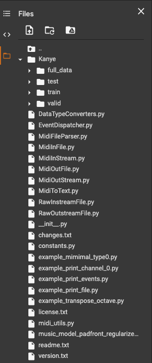

## [Project Page](https://v4lakers.github.io/kanyeWestMusicGeneration/)

### Running the Code
Directions to run the code can be found in the file Kanye_Music_Generation.ipynb. Make sure your directory looks like
this. Results can vary greatly due to the nature of the model parameters.

### [Acknowledgements](https://docs.google.com/document/d/1mv6ZL3bcY1lyZmkU2nr1XybpBQhd2-bzV8YrhheQuNs/edit)

