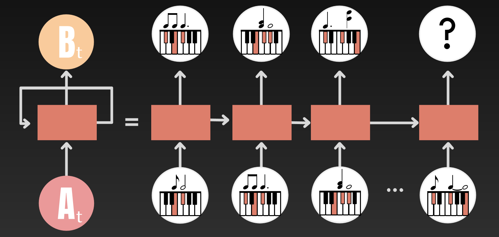

## Abstract
Yeezus. Ye. The Louis Vuitton Don. Born in Atlanta and raised in Chicago, the musical icon of our generation known as Kanye Omari West has changed the world with his timeless music. From the uplifting beats featured in his debut album “The College Dropout”, to the unorthodox blend of synthetics and vocals of “Graduation”, to the christian hymns of “Jesus is King”, West continues to defy established musical patterns while also creating melodies that have rocked the 21st century. 

This project focuses on this phenomena, namely deconstructing West’s melodies to discover some kind of underlying pattern in order to generate new & unheard of melodies that maintains Kanye’s style. In other words, does a computer have what it takes to generate a beat that could trick even the most devoted of Kanye West savants into thinking the beat is authentic?

## Introduction

RNN and music generation go together like peanut butter and jelly. RNN’s (recurrent neural networks), as defined by wikipedia [1], is a class of artificial neural networks where connections between nodes form a directed graph along a temporal sequence. What makes RNN’s more powerful than some of its other machine learning colleagues is that RNN’s maintain a “state” that allows the model to retain information no matter how long a sequence is. Since piano music generation has been a common application of RNN’s [2] [3], I decided to supply my model with piano melodies of West’s music in the hope of generating new “kanye-like” melodies in the form of piano notes. 

My results began with a thud...literally. For some reason, any serene melody was drowned out by loud piano banging as if someone used the palm of their hand to vehemently press down on a piano. I applied various deep learning tactics and changed parameters to reach a melody that was free from piano banging and rich in a clear and bliss melody. 

## Literature Review
Processing Piano Music
Using RNN for music generation has been a widely studied topic in the past few years. For simplicity purposes, I decided to refer to a blog that was able to explain how RNN’s generate piano sheet music in a matter that was clear and concise to me [4].  RNN for music generation isn’t too different from RNN for text completion or text generation. Instead of feeding one word at a time into the model, we feed one note at a time. Now, you are probably wondering... “Okay but like, how do you do it?” Good question. As mentioned before, we will be working with piano music. This works out pretty well because it is clear what notes are being played at certain times. How do we know which notes are being played at some time ti ? * cue MIDI files*. Midi files, also known as musical instrument digital interface, is essentially a sequence of notes over a time period. The image below is what a .midi file looks like.  

You can think of this as the “technological” way of reading piano sheet music. The x axis (length of the song) acts as the time while the y axis (size 88 because there are 88 playable notes) lets us know which notes are being played. We can turn this into a matrix of size 88 x tn where tn is the length of the song. For example, the column t91 will tell us which of the 88 notes are being played at time step 91.  

Once we have our tn columns, we feed each column ti , 1 ≤ i ≤ n,into our model one at a time. Note that the vector ti can have multiple 1’s throughout the vector. One could find a way to encode this vector, but for the sake of space, inputting an 88x1 vector will work as well. 

#### Code
So we have a good idea of how we can process piano music in a form that is digestible to a computer. We will now talk about the ipython notebook that makes the music generation magic happen. Thankfully for me, there was a python notebook on github that had a rudimentary approach to using RNN’s for piano generation [5]. There were several functions that took care of converting a midi file to the vectors explained above, along with sampling the final model to produce the generated music file. The notebook also had a big block of code that focused on finding the best learning rate (the lrfinder). This piece of code was intriguing to me because it automated the process of finding the best learning rate instead of manually trying different rates. This chunk was essential in creating the ideal model. No question about it. I decided to leave the lrfidner and “midi to vector” functions untouched just because it was a process that was already working perfectly. Once we finish training the model with an optimal learning rate with a set of training and validation midi files, we are ready to generate some tunes. This is where sample_from_piano_rnn comes in. In a nutshell, we start at some arbitrary note (unless a starting point is given). We set this starting point to be the first notes played in our final output. We then run through a for loop that loops for the length of the given “sample_length”. In the for loop, we take a look at what the current notes are. We use this as the base to generate the next set of notes by sending the current notes to the RNN, and getting an output of the predicted next set of notes. This predicted set of notes will be our new “current notes” and will be appended to our final output. We repeat this process until we have reached the end of the sample length. When the for loop is finished, we are left with a final output tensor that contains the entire generated music clip and returns that back to the user. Code and comments for this can be found in the notebook under the “def smaple_from_piano_rnn” function. 

What I did modify was the forward and train functions. Originally, the forward step applies the RNN, then adds a batch normalization, then a dropout, and then one last linear layer. The supplied loss function was cross entropy loss. I decided to clean this code up a bit and make it easier for myself to mess around with parameters. At the top of the notebook, I created a cell that holds static variables (similar to FINAL_STATIC_VARIABLE in java). 

By setting these variables at the start of the code, I could change parameters of my choosing. I will be explaining the training parameters in the discussion below. I will, however, talk about the MIDI file variables here. “Sample Length” is the size of the audio clip we wish to generate. The longer the sample length, the longer the output audio file will be. Next is temperature. Temperature can be thought of as “how many” notes we want. Higher temperature gives a higher probability for the model to generate more notes at a given time position. Finally, we have dt which specifies the temp at which the notes are played. Lower dt, lower the tempo. 

## Data
We talked at a high level of how RNN takes piano music, trains a model, and outputs generate music by sampling from the RNN we built. Now, we will apply these mechanisms to the task at hand: make some kanye-like beats! Due to the fact that RNN’s have shown great success in generating piano sheet music, I decided to use piano covers of Kanye’s music from youtube as my data. This does 2 things. First, it allows the RNN to work with piano music which has been shown to produce great results. Second, the piano cover maintains the melody in West’s music which is what we are most interested in. As stated before, the RNN template model I am using requires piano sheet music in the form of .midi files. Software such as garageband can read this sequence and output the sound that the sequence of notes play through an instrument of the users choosing. So how do we convert youtube videos to midi files? Free online conversion tools with tons of pop up ads of course! Let’s start with an example, say I want to include “Power” by Kanye West in my dataset (awesome song by the way). I would proceed to search on youtube “Kanye West Power Piano Cover”. (For all songs used on youtube, check out [6]). Before I go ahead and settle with the first result I see, I put the video through a strict vetting process. First, I have to make sure that this video has clear audio, no static background noise, and no vocals. (in some covers, people sing along to the song or give instructions on how to play the song). Once a video has gone through this vetting process, I proceed to use an online conversion tool that takes in a youtube video and outputs the mp3 file for this video [7]. Note, that this mp3 file is an audio file and only retains the sound in a youtube video, nothing else. Once I have the mp3 file, I use one final online conversion tool that takes in a mp3 file as input and outputs the .midi version of this file [8]. I repeated this process several times for as many piano covers of West’s music I could find. In total I had 3.5 megabytes worth of Kanye West .midi files which amounts to about 100 minutes of music. I also used .5 megabytes worth of separate piano chord and string .midi files to aid in the learning process (this will be explained why below). In total, the data consists of 4 megabytes of .midi files with about 50% going to train, 25% test, and 25% validation. 

## Results
#### Pre Parameter Tuning Discussion
From this project, I learned what sets apart a self proclaimed “data scientist” from a true machine learning expert. Being able to run data through a model that takes a couple lines of code is one thing. Knowing what model, dropout rate, layers, and optimizer to use is a whole different story. When I first started building my model, I used the default parameters that were in the notebook. The result? One of the best sounding horror film soundtracks you will ever hear. What makes this project so challenging is that you can’t soley go off the loss to judge the results. What may sound good to me is not an objective measure if the model is doing well or not. It’s really just a measure of how much I “think” the output music file sounds like Kanye’s music. Nonetheless, this did not stop me in my pursuit of improving my model to create a music file that had some kind of rhythm that sounded both harmonious and “kanye” like. 

Sometimes, we have to go backwards to go forwards. That is exactly what I did here. As stated before, the output music sounded like a horror movie soundtrack due to the frequent “loud banging piano noises”. Upon further examination of the piano covers I used, I realized the issue. Oftentimes, piano players like to add effect or emphasis to certain parts of a song by playing some notes louder than others. While this may sound aesthetically pleasing, the model just sees it as something that needs to constantly be included. Using the principles from transfer learning, I decided to bolster my dataset with 5-10 second piano chords from the Nottingham Data Set [9]. My theory was that by adding these small chords to the train, test, and validation set, the model would do a better job of “smoothing” the overall sound of the music file to better hear the melody that was constructed by the model. This is exactly what happened. Once I introduced batches of piano chords in the training process, the output improved. While there were still instances of loud piano banging and cacophony of sounds, the melody I was trying to unearth started to become a little more clear. 

Transfer learning did help in reducing the loud “piano banging”, but this ear sore was still present nonetheless. The next few parameters I will be discussing greatly improved my results, but need to be taken with a grain of salt. Results have the potential to vary greatly, even when running the code with the exact same data and the exact same parameters. This is due to the fact that some of these parameters act randomly in nature. While some parameters seemed to give consistent results, other parameters caused too much variation in the results so it is incredibly hard to pinpoint what is causing what. However, I will walk through the process I used to reach the best sounding melody I could achieve. 

#### Parameter Tuning
This is where the fun begins. I started with varying Epochs. At first, I was at 7 epochs and was curious to see what kind of effect drastically changing this would have. I started with just 1 epoch. This surprisingly addressed the “loud banging piano noises”. However, there was a tradeoff. There was no melody whatsoever. It just sounded like someone used one finger to hit random keys on a piano (much like how I play piano). I then took the other extreme and went with 25 epochs. This did take much longer to train but it was worth it. The “loud piano banging” did return, but I could definitely hear a rhythm in the music. I decided to stick with 25 epochs and go from there. The next thing I varied was the hidden layer size. I tried 206, 512, 1024, and 2048. There seemed to be a drastic difference between 2048 and 1024. Adding too many hidden layers did have diminishing returns as the model with 2048 hidden layers only increased the loud piano banging. 206 layers had the least “piano banging” but like when the epoch was at 1, the rhythm was nonexistent and the music seemed random. I found 512 hidden layers to be that perfect balance between hearing some kind of melody while also not hearing too much loud piano banging. 

The next 2 parameters I changed made a tremendous difference. I realized that I needed to improve on regularization. This is where I decided to change my dropout to AlphaDropout.In addition, I felt like I may be running to an issue of exploding gradients so I went ahead and upped the clip size to 3 instead of 1. These two changes got rid of the loud piano banging almost entirely! This made room for a melody to actually be heard. Once I was able to hear more of a melody, a new problem arose. The notes being played were far too choppy. Remember that example about hitting random keys on a piano with one finger? The music now sounded like hitting keys on a piano with one finger, but maintaining some kind of pattern. The final parameter I changed was the RNN itself. I was using an LSTM throughout this project and decided to take a leap of faith and use GRU. It seems like the gates of the GRU gave more credence to maintaining notes for longer periods of time compared to the results from the LSTM. This finally produced a .midi file that sounded pretty good. It wasn’t perfect, and there were a few off key sounds. However, I was pleased with the tremendous progress that was made and decided to temporarily stop here. I handed over the final .midi file to my brother (who is an expert in music), as the focal beat and rhythm to a more complete beat on garageband. 

#### Post Parameter Tuning Discussion
Now that I have walked you through the process I took to reach my results, it is with a heavy heart that I must say that you will most probably not get the same results by following my steps. As mentioned before, parameters like the dropout are random in nature and can produce different results at different times. Let’s start back at the first thing I changed which was transfer learning. By supplying samples of chords to all the data sets, I was able to make progress on “smoothing” out the output music. When it came to epochs, I was also getting varied results. However, anything over 15 epochs produced clearer melodies in the output music and gave me the confidence to use at least 15 epochs during training. However, it is still unclear what the optimal number of epochs is in this situation. 30 was a little on the high side and took forever to train. I felt like after a certain point, the results sounded essentially the same so I just stuck with 25. The next change was the kind of RNN. Fortunately, I was able to see clear differences between LSTM and GRU’s. LSTM were a little too choppy in the notes while GRU maintained short choppy notes and notes that were longer as well. For this reason, I decided to stick with GRU because it seemed like a good balance between shorter and longer notes. The next parameter that I was able to vary was hidden size. The results here were also somewhat random, but when I stuck with 512 hidden layers, I was able to get consistently better sounding tunes than larger hidden layers sizes. Clip size was also pretty consistent as I noticed that larger clip size did reduce the craziness and piano banging in the output. Dropout was the final parameter I changed and this left me scratching my head after every run. Sometimes Alpha Dropout gave me good results, sometimes it didn’t. Normal dropout didn’t vary as much as the results from Alpha Dropout, but also gave strange results. Sometimes, I would get an output file with 5 total notes played. There are so many things going on with this model, it was hard to tell why certain results were coming out the way they did and if varying certain parameters were affecting the impact of other parameters. I believe I was pretty lucky to get an aesthetic sounding melody because I have yet to recreate something of that nature again. 

## Future Work
As you can probably tell, there is a whole lot that can still be done. First, I would improve on my data set. The midi files I have are decent in quality, but it is the train/test/valid split that I think can be improved on. The ratios I have right now are 50/25/25 which definitely can be altered. I would also be a little more selective of the additional chord midi files that I add to each dataset. I randomly selected random piano chord files from the Nottingham dataset and distributed it proportionally to the train/test/valid directories. Improving the quality of the data is a bulk of the work in this project and I look forward to having a dataset that I feel more confident in. 

In addition to better curating my dataset, I would also be curious to see the results of this project if I made one model for each of Kanye’s albums. My current dataset is a compilation of piano covers from his first album in 2004 to his most recent album in 2019. Each of Kanye’s albums has its own personality and any two albums can be incredibly different from each other, even if the two albums were released around the same time period. This could be a reason why the model struggles to come up with a strict pattern in the generation phase. There seems to be so much going on with Kanye’s music that it can be tricky to get a simple and clear melodic tune. In the future, I would partition the data according to the album and then make train/test/valid splits. 

The last thing I would vary would be the parameters. My approach to parameters tuning was “if it shows improvement, save the current parameter and go on to the next one”. This is essentially a greedy algorithm approach and while I did end up with decent results, I am missing out on the potential for a better sounding output file if I change the way I fine tune the parameters. Ofcourse, the best way to do this is to better understand the impact each parameter (such as linear layers, RNN gates, and dropouts) is having on the music. This will help me avoid the brute force approach and make more conscious and informed choices of parameter tuning which will hopefully lead to more aesthetically pleasing results in less time. 

## References

[1] “Recurrent Neural Network.” Wikipedia, Wikimedia Foundation, 20 Aug. 2020, en.wikipedia.org/wiki/Recurrent_neural_network.

[2] https://archives.ismir.net/ismir2019/paper/000112.pdf

[3] Simon, I. (2017, June 29). Performance RNN: Generating Music with Expressive Timing and Dynamics. Retrieved August 20, 2020, from https://magenta.tensorflow.org/performance-rnn

[4] Pakhomov, D. (n.d.). Daniil's blog. Retrieved August 20, 2020, from http://warmspringwinds.github.io/pytorch/rnns/2018/01/27/learning-to-generate-lyrics-and-music-with-recurrent-neural-networks/

[5] Carpenter, J., & Grover, P. (2018). Music-generation. Retrieved from https://github.com/jmcarpenter2/music-generation
[6]https://www.youtube.com/playlist?list=PLpqid64jc0c3r5isiicoPWn3ltZA-SHwW

[7] https://ytmp3.cc/en13/

[8]https://www.conversion-tool.com/audiotomidi/

[9] Nottingham Database. (n.d.). Retrieved August 20, 2020, from https://ifdo.ca/~seymour/nottingham/nottingham.html

